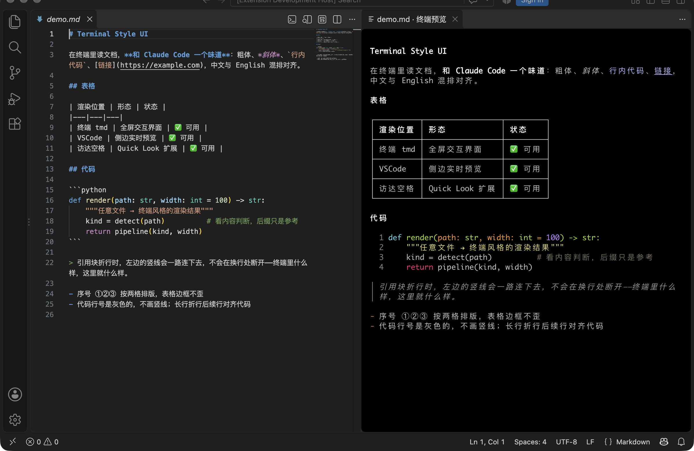
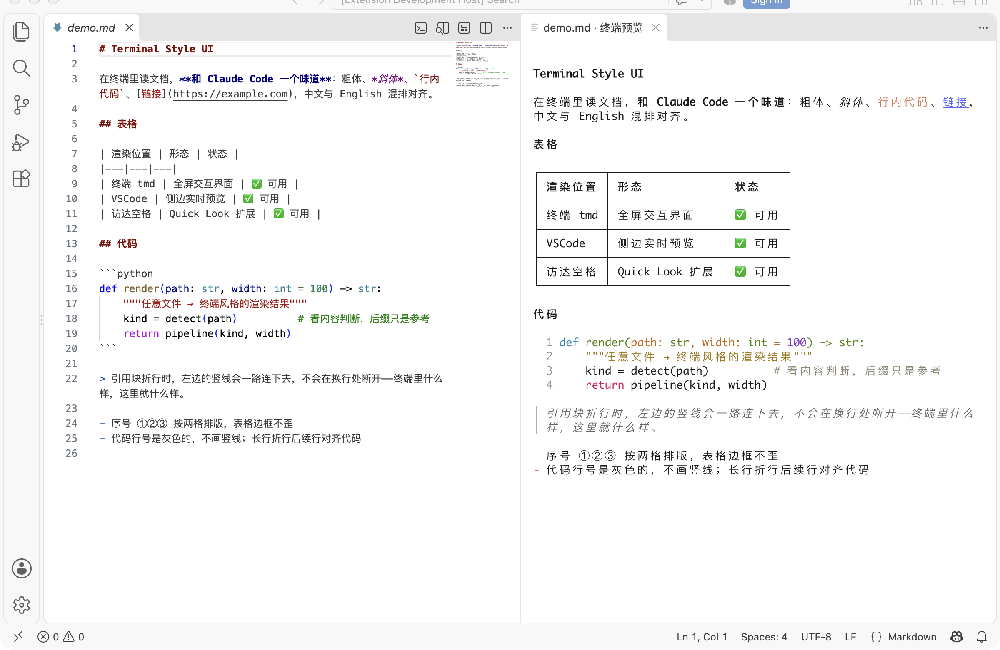
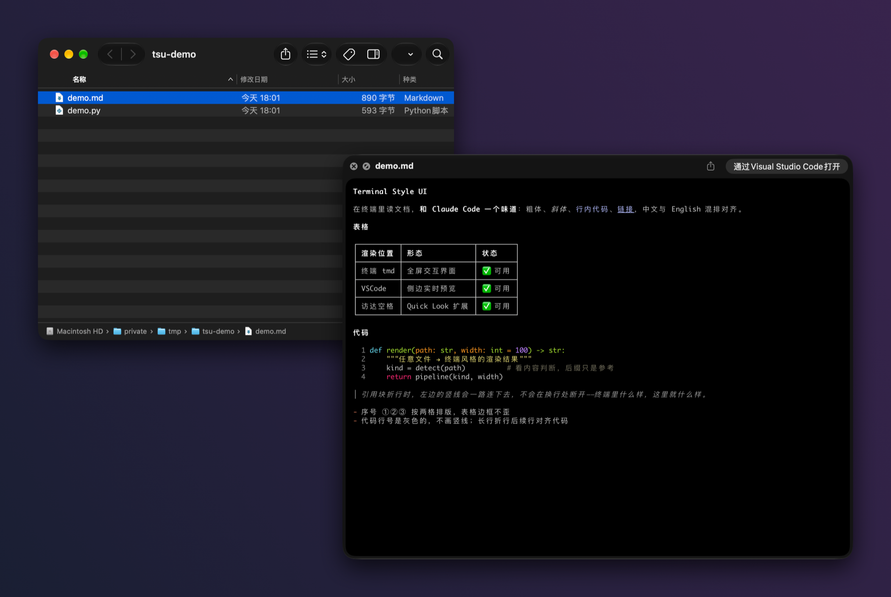
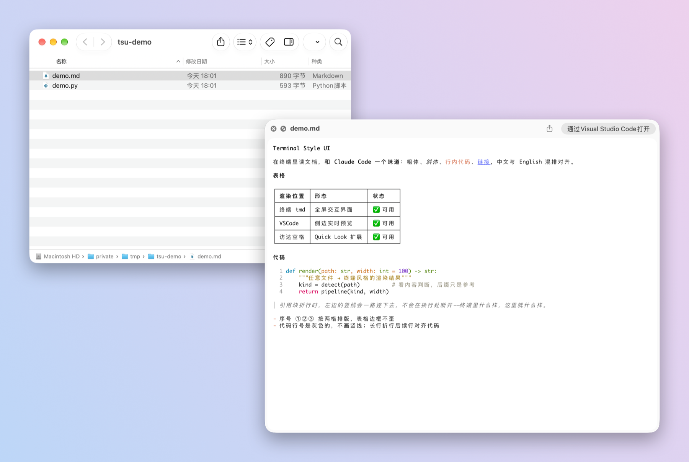
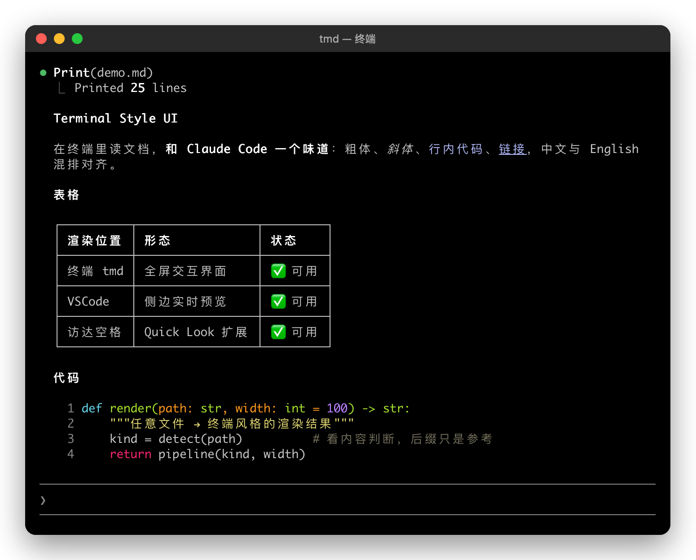
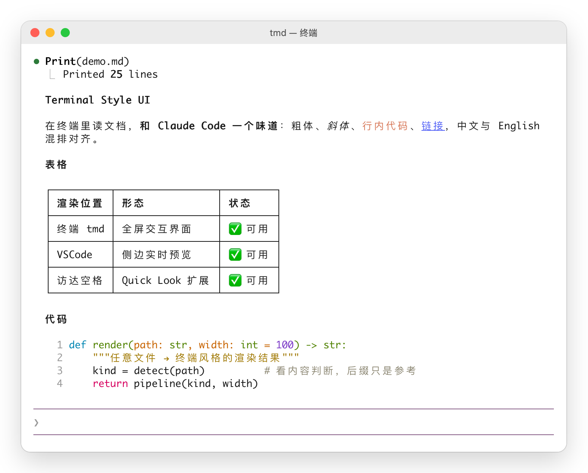
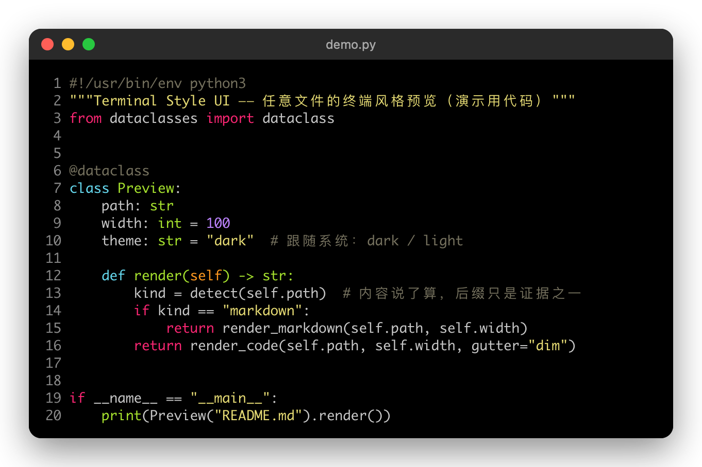
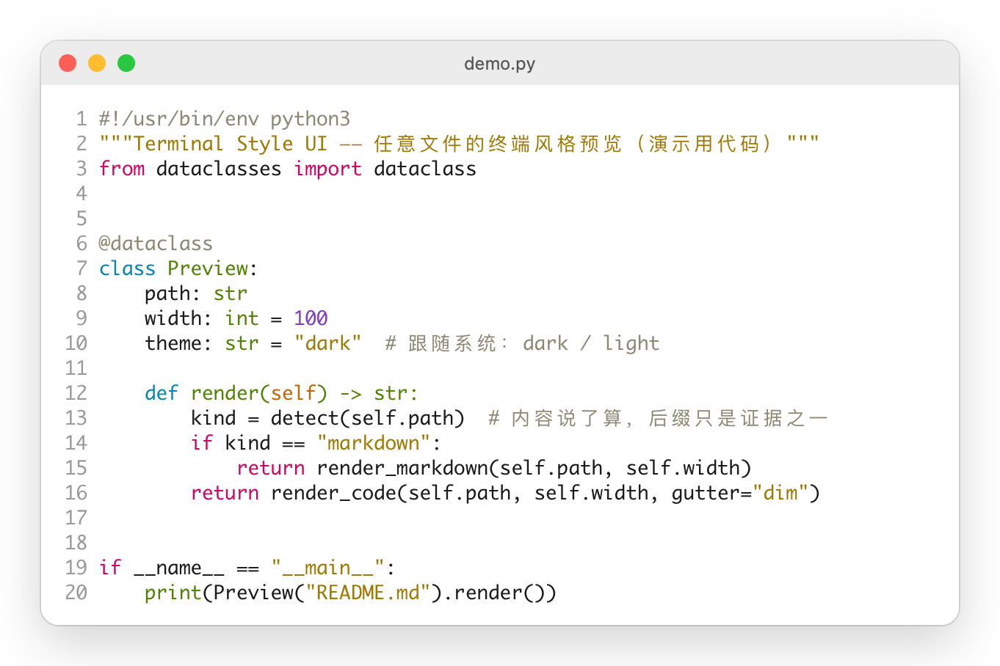

# terminal-style-ui

**版本 0.1.0** · MIT

终端 TUI 风格的文档与代码渲染：Markdown / 任意文件 → 与终端里一模一样的排版（制表符表格严丝合缝、中英文对齐、Claude Code 同款代码行号）。一套渲染核心，三个用处：

| 目录 | 是什么 |
|---|---|
| [`terminal-style-ui-web/`](terminal-style-ui-web/) | 渲染库（Node / 浏览器 / JavaScriptCore）+ 命令行 `tmd` |
| [`terminal-style-ui-vscode/`](terminal-style-ui-vscode/) | VSCode 插件：任意文件的侧边实时预览、导出 HTML / PDF |
| [`terminal-style-ui-quicklook/`](terminal-style-ui-quicklook/) | Mac 快速查看：访达里选中文件按空格预览 |

## VSCode：边写边看

## 访达：按空格预览

## 终端：tmd

## 任意文件

后缀只是证据之一，内容说了算：没后缀的脚本看 `#!`，`.txt` 里是 JSON 就按 JSON，`.WIKI` 里满是 Markdown 语法就按 Markdown。代码同 Claude Code 的 Write 输出——灰色行号、不画竖线。

## 安装

| 用处 | 安装 |
|---|---|
| VSCode 插件 | [Releases](https://github.com/ApolloZhangOnGithub/terminal-style-ui/releases) 下载 `.vsix` → `code --install-extension terminal-style-ui-vscode-0.1.0.vsix` |
| Mac 快速查看 | Releases 下载 `Terminal-Style-UI-0.1.0.zip`，解压后把 App 放进「应用程序」，打开一次 |
| tmd / 渲染库 | `npm install -g @apollozhangongithub/terminal-style-ui --registry=https://npm.pkg.github.com`（GitHub Packages，需先 `npm login --registry=https://npm.pkg.github.com`） |

所有上游依赖（pi-tui、主题、cli-highlight、highlight.js、chalk）都已打包进去，不需要另装运行时。

## 开发

- 构建：`cd terminal-style-ui-web && npm install && npm run build`（打包上游依赖；构建时需要一份含定制版 pi-tui 的 runtime，位置由 `TSU_RUNTIME` 或 `~/.local/lib/terminal-style-ui/runtime` 给出）
- 配图：`media/make.sh` 一键重拍（演示文件 `media/demo.md`、`media/demo.py`，截图里不含本机路径）；`./make.sh --finder` 另拍真实的访达 + 快速查看（会临时接管访达、切换系统深浅色，拍完恢复）
- 变更记录：[CHANGELOG.md](CHANGELOG.md)
